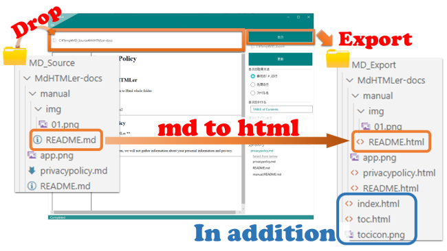

# Usage

## Step

マークダウンファイルの入ったフォルダを用意

1. 用意したフォルダをアプリの上部にドロップ
2. 「出力」ボタンを押す
3. 保存先がきかれます。保存先を指定してください

 （うまくいけば）出力先のフォルダにHTMLファイルができる

## Step (en)

Prepare a folder containing markdown files.

1. Drop the prepared folder on the top of the application.
2. Press the "Export" button.
3. Specify the destination folder.

HTML files will be created in the destination folder.

## ついでに：

- index.html と toc.htmlを追加で作成します。
- toc.html にアイコンを設定することも可能です。
- 不要な場合は削除してください。

toc.htmlに表示するテキストは3種類の中から選択できます。

1. 最初の「＃」の行
2. 先頭の行
3. ファイル名

## In Addition (en)

- Create index.html and toc.html additionally.
- Icons can also be set in toc.html.
- If you do not need them, delete them.

You can choose from three types of text to be displayed in toc.html.

1. first "#(Heading level 1)" line
2. first line
3. file name

## 既知の不具合

- あまり多くのファイル（を含むフォルダ）を処理するとアプリ止まるか落ちることがあります。

## Known Issues (en)

- If too many files (or folders containing files) are processed, the application may stop or crash.

end.
