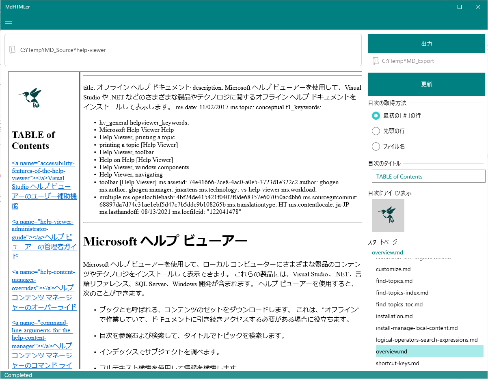

# Usage

## Step

マークダウンファイルの入ったフォルダを用意

1. 用意したフォルダをアプリの上部にドロップ
2. 「出力」ボタンを押す
3. 保存先がきかれます。保存先を指定してください

 （うまくいけば）出力先のフォルダにHTMLファイルができる

## 既知の不具合

- あまり多くのファイル（を含むフォルダ）を処理するとアプリが落ちることがあります。（修正中）

